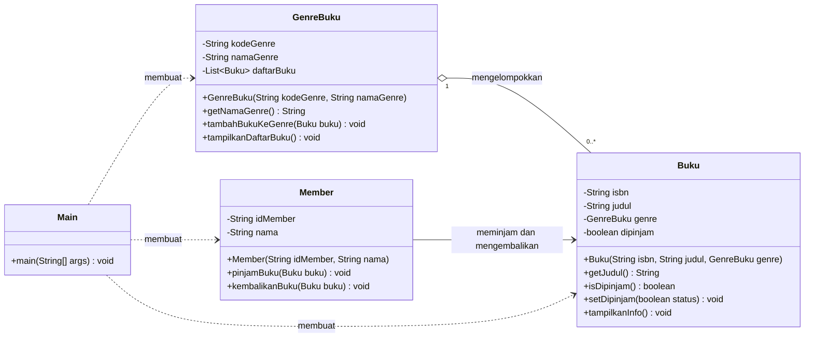

# Aplikasi Perpustakaan

Proyek Java sederhana untuk memenuhi **Tugas Minggu Ke-2 Pemrograman Berorientasi Objek**. Program memodelkan hubungan antara `Member`, `Buku`, dan `GenreBuku` dalam proses pengelolaan serta peminjaman buku di perpustakaan.

## Fitur

- Mengelompokkan buku berdasarkan genre.
- Menghubungkan buku dan memasukkannya ke daftar genre yang sesuai.
- Menampilkan daftar dan informasi buku.
- Meminjam serta mengembalikan buku melalui member.
- Memeriksa ketersediaan buku sebelum dipinjam.

## Analisis Relasi

| Class | Relasi | Penjelasan |
| --- | --- | --- |
| `GenreBuku` dan `Buku` | Agregasi | Satu genre dapat mengelompokkan banyak buku. Buku tetap menjadi objek tersendiri dan menyimpan referensi ke genre. |
| `Member` dan `Buku` | Asosiasi | Member berinteraksi dengan buku melalui proses peminjaman dan pengembalian. |
| `Main` dengan seluruh class | Dependensi | `Main` membuat objek dan mendemonstrasikan hubungan antarkelas. |

## Class Diagram



## Struktur Proyek

```text
Tugas/
├── src/
│   ├── Buku.java
│   ├── GenreBuku.java
│   ├── Main.java
│   └── Member.java
├── .vscode/
│   └── settings.json
├── .gitignore
└── README.md
```

## Menjalankan Program

Pastikan Java Development Kit (JDK) sudah terpasang. Jalankan perintah berikut dari direktori utama repository:

```shell
javac -d bin src/Buku.java src/GenreBuku.java src/Member.java src/Main.java
java -cp bin Main
```

## Contoh Output

```text
=== Genre G01: Teknologi ===
- Pemrograman Java
- Struktur Data

=== Genre G02: Sains Fiksi ===
- Dune

=== INFORMASI BUKU ===
- [978-01] Pemrograman Java | Genre: Teknologi
- [978-02] Struktur Data | Genre: Teknologi
- [978-03] Dune | Genre: Sains Fiksi

=== TRANSAKSI MEMBER ===
J04001 - Haka berhasil meminjam: Pemrograman Java
J04001 - Haka berhasil mengembalikan: Pemrograman Java
```

## Source Code

- [`Buku.java`](src/Buku.java)
- [`GenreBuku.java`](src/GenreBuku.java)
- [`Member.java`](src/Member.java)
- [`Main.java`](src/Main.java)
